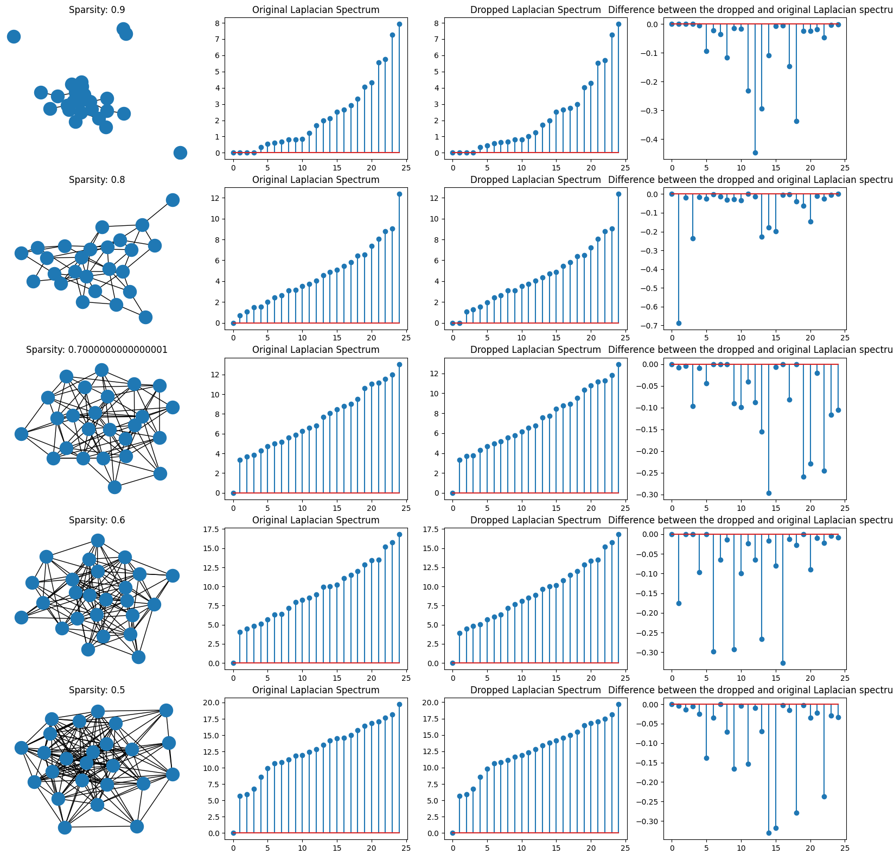
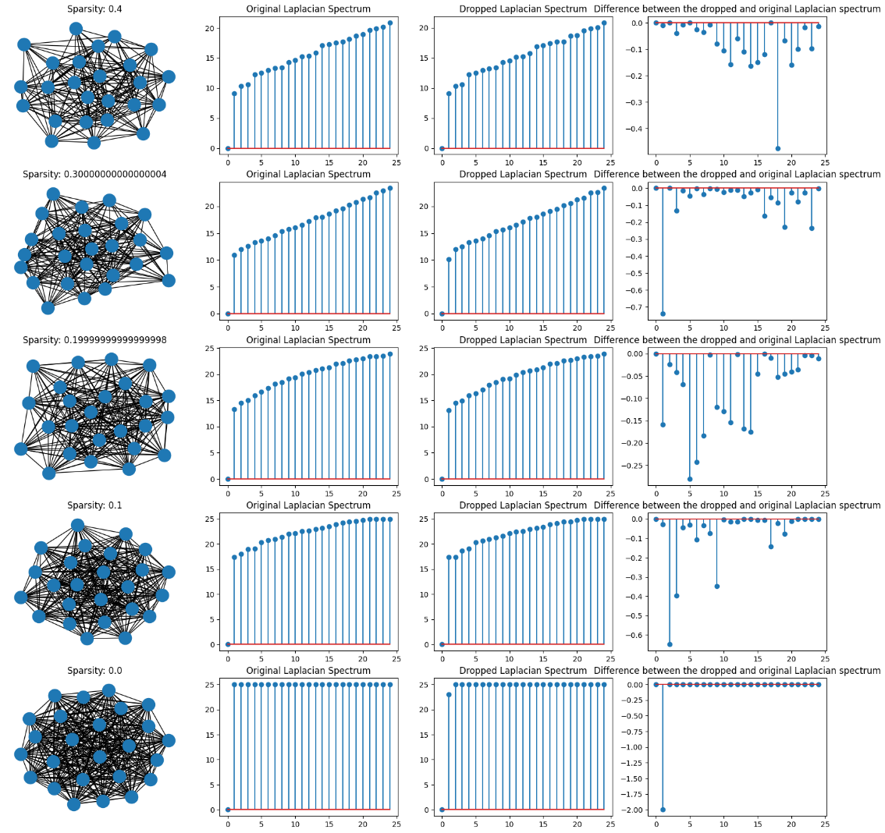

# GraphPerturbationsSpectralShift

# Spectral Impact of Graph Topology Perturbations: Variance Analysis of Normalized Laplacian Eigenvalues

$${\color{red}This \space work \space is \space a \space ongoing  \space project \space and \space may \space not \space reflect \space real \space time \space updates. \space We \space appreciate \space your \space understanding.}$$

## Overview
This repository contains the research report *"Spectral Impact of Graph Topology Perturbations: Variance Analysis of Normalized Laplacian Eigenvalues"*, which explores how changes in graph topology affect the spectral properties of the normalized Laplacian matrix. Specifically, the report analyzes the variance of eigenvalues under various graph perturbations, offering theoretical insights and potential applications in network science, machine learning, and optimization. The report can be found here - [Spectral_Impact_of_Graph_Topology_Perturbations.pdf](https://github.com/arindammajee/GraphPerturbationsSpectralShift/blob/main/Spectral_Impact_of_Graph_Topology_Perturbations.pdf)

##
---

## Table of Contents
1. [Introduction](#introduction)
2. [Research Objectives](#research-objectives)
3. [Methodology](#methodology)
4. [Key Findings](#key-findings)
5. [Applications and Future Work](#applications-and-future-work)

---

## Introduction
Graphs are essential structures for modeling relationships in complex systems such as social networks, communication systems, and biological processes. The spectral properties of a graph's normalized Laplacian matrix provide valuable insights into its structural characteristics. This report focuses on how graph perturbations, such as adding or removing edges or nodes, impact the variance of eigenvalues, revealing the sensitivity of graph spectra to structural changes.

---

## Research Objectives
The primary objectives of this research are:
- To examine how topological changes in graphs influence the eigenvalue variance of the normalized Laplacian matrix.
- To develop a theoretical framework for analyzing these spectral changes.
- To propose methods for managing graph perturbations in real-world applications like dynamic network analysis and graph-based learning.

---

## Methodology
The study employs:
- **Mathematical Modeling:** A rigorous mathematical analysis of eigenvalue distributions under different graph perturbation scenarios.
- **Spectral Analysis:** Computation of eigenvalue variances for synthetic and theoretical graph models.
- **Comparative Studies:** Evaluation of different perturbation types, including edge additions, removals, and rewiring.

---

## Key Findings
- Graph perturbations significantly affect the variance of eigenvalues, with larger perturbations causing more pronounced spectral shifts.
- Edge additions and removals exhibit distinct variance patterns based on the graph structure and degree distributions.
- Rewiring strategies can be employed to mitigate adverse spectral effects, optimizing graph-based models in learning applications.

Here is an experimental results on how Laplacian spectrum varies with edge sparsity. We have controlled the sparsity after changing number of edges in the graph.
 
 

---

## Applications and Future Work
This research opens several avenues for future exploration:

- **Graph Neural Networks:** Developing GNN models robust to graph perturbations by incorporating spectral regularization.
- **Dynamic Networks:** Applying eigenvalue variance analysis to time-evolving graphs for prediction tasks.
- **Network Design Optimization:** Designing algorithms to optimize graph structures, reducing eigenvalue variance for stable network performance.
- **Real-World Validation:** Conducting empirical studies on large-scale datasets from social networks, transportation systems, and biological systems.

---

For further information, feel free to contact **Arindam Majee (Email - majeearindam4@gmail.com)** or submit issues through this repository. Contributions and collaborative discussions are welcome!
